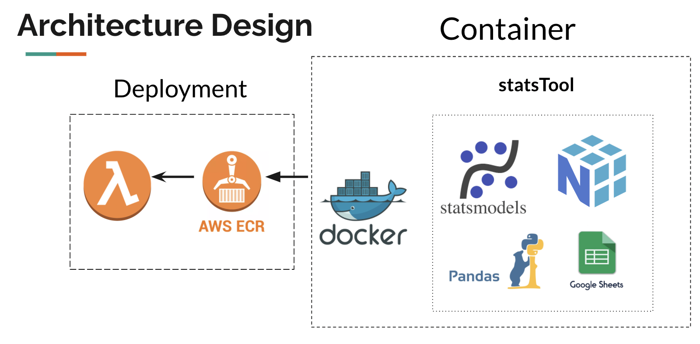

# statsTool
## Functions
1. Prediction (autoregression model by buildings)
2. Autocorrelations (autocorrelation by building)
3. Stats(Cases by building sorted by number of cases)

## Architecture

## Prerequisite
1. You need a Google Sheet service account and API.
2. You need to download the service account and save as google_credentials.json in .env folder
4. You need to set a password for the service and save as password.json in .env folder
4. You need to set lambda deployment parameters({"ImageUri":xxxx(your container image uri),"Role":xxxx(IAM role for lambda)}) for the service and save as aws_config.json in .env folder
5. You need to have an API gateway for your lambda function.

## Setup
1. open the terminal inside the repo folder.
2. docker build [erc account number].dkr.ecr.us-east-1.amazonaws.com/[tag name] .
3. ecr get-login-password --region [aws region] | docker login --username AWS --password-stdin [erc account number].dkr.ecr.us-east-1.amazonaws.com
4. docker push [erc account number].dkr.ecr.us-east-1.amazonaws.com/[tag name]
5. set "ImageUri" in the json to [erc account number].dkr.ecr.us-east-1.amazonaws.com/[tag name]
6. run python run.py and the function will be deployed.

## Test
if you deploy lambda with API gateway you can try the following with api endpoint.

curl --header "Content-Type:application/json"    --request POST       \ --data '{"password":(your microservice password), "method": "prediction"}' \ (your api endpoint)

<b>Notes: method can also be “stats”,”autocorrelation”</b>
